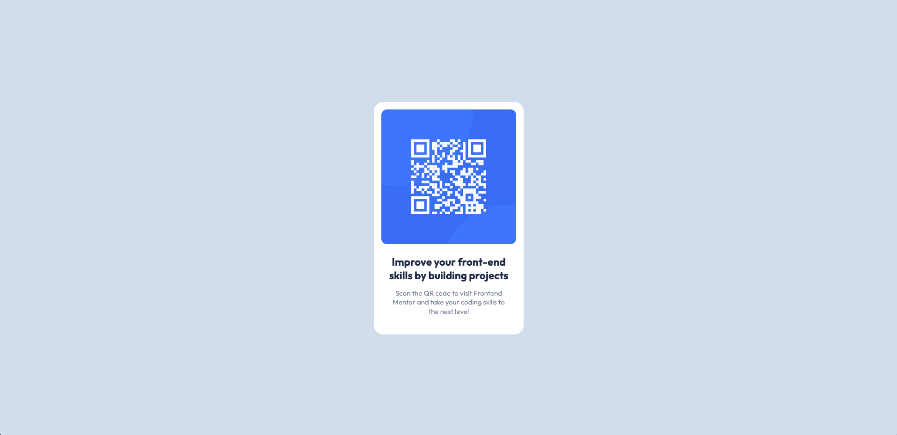

# Frontend Mentor - QR code component solution

This is a solution to the [QR code component challenge on Frontend Mentor](https://www.frontendmentor.io/challenges/qr-code-component-iux_sIO_H). Frontend Mentor challenges help you improve your coding skills by building realistic projects. 

## Table of contents

- [Overview](#overview)
  - [Screenshot](#screenshot)
  - [Links](#links)
- [My process](#my-process)
  - [Built with](#built-with)
  - [What I learned](#what-i-learned)
  - [Useful resources](#useful-resources)
- [Author](#author)

## Overview

### Screenshot

### Links

- Live Site URL: 

### Built with

- Semantic HTML5 markup
- CSS
- Flexbox

### What I learned

I learned about semantic HTML5.

### Useful resources

- [FreeCodeCamp](https://www.freecodecamp.org/news/semantic-html5-elements/#:~:text=Semantic%20HTML%20elements%20are%20those,content%20that%20is%20inside%20them.) - This helped me for use semantic HTML5. 

## Author

- Frontend Mentor - [@edmarpaulino](https://www.frontendmentor.io/profile/edmarpaulino)

